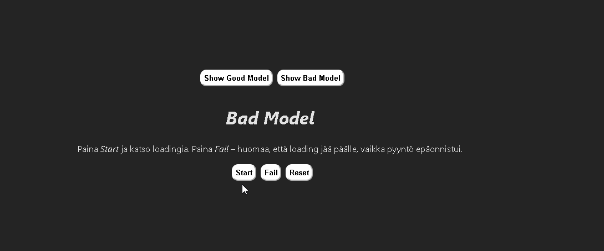

# UI State Playground

> ⚠️ **Work in progress**  
> The core ideas and implementation are in place, but visual assets and final
> polish (such as demo previews) are still being finalized.

A small React + TypeScript project focused on **explicit UI state modeling**.

The purpose of this project is to explore how common UI states (idle, loading,
success, error) can be modeled in a way that makes invalid UI combinations
impossible by design.

Rather than building features, this project focuses on **clarity, correctness,
and state-driven rendering**.

---

## Why this project exists

In many applications, UI state is modeled using loosely coupled boolean flags such
as `isLoading` and `hasError`. While simple at first, this approach easily leads
to broken UI states where loading, error, and content overlap.

This project explores an alternative approach:

- modeling UI state explicitly with TypeScript union types
- handling state transitions through a reducer
- making invalid UI states unrepresentable by design

---

## Visual comparison: bad vs good UI state modeling

The difference between implicit and explicit UI state modeling becomes most
obvious when visualized.

| Bad model (boolean flags)        | Good model (explicit UI states)   |
| -------------------------------- | --------------------------------- |
|  |  |


**Bad model:**  
Multiple independent boolean flags (`loading`, `error`) allow invalid UI
combinations. For example, loading can remain active even when an error occurs.

**Good model:**  
UI state is represented as a single discriminated union. Only one valid state
(idle, loading, success, error) can exist at a time, making the UI predictable
by design.

---

## Core ideas

- UI state is modeled with TypeScript union types instead of loose objects
- State transitions are handled with `useReducer`
- Rendering is driven by a single explicit `status` field
- Invalid UI combinations are prevented by design through the type system

These ideas are explored through examples focusing on:

- loading vs idle confusion
- error states that overlap with loading
- predictable success and error rendering

---

## Implementation overview

- **GoodModel**  
  Uses a reducer and a discriminated union (`UiStatus`) to ensure only valid UI
  states can be represented and rendered.

- **BadModel**  
  Uses multiple boolean flags to intentionally demonstrate how invalid and
  overlapping UI states can occur.

- **ManageModels**  
  Switches between the two implementations to allow direct visual comparison.

---

## What this project demonstrates

- How TypeScript can enforce correct UI state modeling
- Why reducer-driven state transitions are safer than ad-hoc boolean flags
- How explicit UI states simplify rendering logic
- How broken UI states emerge from implicit state modeling

---

## Tech stack

- React
- TypeScript
- Vite
- 
---

## Project status

This project is under active development.

The core ideas and main examples are in place, but the project is still evolving.
Further refinements, visual improvements, and additional state modeling examples may be added over time.

---

## Getting started

```bash
npm install
npm run dev
```
